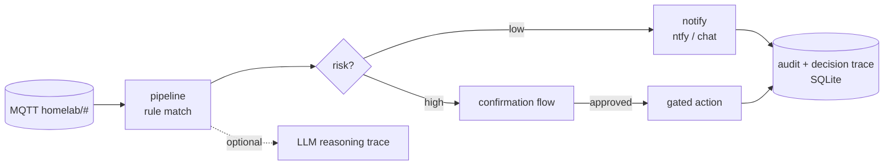

# brain-bus

An event-driven ops-automation engine for a self-hosted fleet. It listens on
MQTT, matches events against a rule set, and turns them into notifications. For
anything risky it runs a gated action that requires confirmation first.

## What it does
- Consumes MQTT events (`homelab/#`) and matches them against declarative rules
- Sends suggestions and notifications over ntfy or chat for low-risk situations
- Routes higher-risk actions through a **confirmation flow** and records the full
  action and confirmation history
- Can call an LLM for a short **reasoning trace**, storing the *why* behind each
  action (rule, confidence, model) so the decisions stay auditable afterwards
- Spots recurring patterns and proposes new rules from them

## Design stance
The engine notifies far more often than it acts, and most rules end in a message
and nothing else. That ratio is intended. Anything that could change system state
has to be switched on explicitly and then confirmed by a person before it runs.

Rules and tool definitions live outside the code, so you bring your own
`config/rules.yaml` and `config/tools.yaml`. What ships here is the engine, with
no live topology baked into it.

## Structure
- `app/pipeline.py`: event, rule-match, decide, notify or act
- `app/rules.py`, `app/registry.py`: rule engine plus tool/registry enrichment
- `app/decide.py`, `app/confirmations.py`: risk gating and confirmation flow
- `app/llm_client.py`: optional LLM reasoning with local/remote fallback
- `app/audit.py`, `app/db.py`: action history and decision trace (SQLite)
- `tests/`: pipeline, registry, LLM-client and decision-trace tests

## Stack
- **Python**, FastAPI, paho-mqtt, SQLite
- **Hardened container**: read-only root filesystem, non-root user, persistent
  data confined to a single mounted directory

MIT licensed.

## About this snapshot

The private version of this repo carries my actual `rules.yaml`, which amounts to
a fairly complete map of the fleet. That file and everything like it gets stripped
by the publishing script, which also rewrites internal addresses to placeholders
and refuses to push while either of two secret scanners is unhappy.

The development history stays private, so the public one starts at the first
release and grows from there. The engine runs at home and is maintained there.
