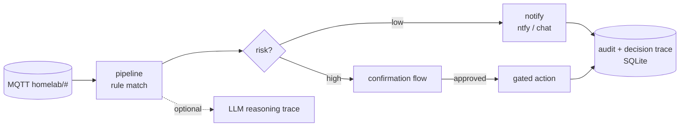

# brain-bus

An event-driven ops-automation engine for a self-hosted fleet. It listens on
MQTT, matches events against a rule set, and turns them into notifications. For
anything risky it runs a gated action that requires confirmation first.

## What it does
- Consumes MQTT events (`homelab/#`) and matches them against declarative rules
- Emits suggestions and notifications (ntfy, chat) for low-risk situations
- For higher-risk actions it runs a **confirmation flow** instead of acting
  blindly, and records the full action and confirmation history
- Optionally calls an LLM for a short **reasoning trace**, and persists a
  per-action *why* (rule, confidence, model) so autonomy stays auditable
- Learns recurring patterns and can propose new rules

## Design stance
Stability and safety before cleverness. The engine is **notify-first**: most
rules decide *not* to act. Anything that could change system state is opt-in and
confirmation-gated. The rule and tool configuration is external, so you bring
your own `config/rules.yaml` and `config/tools.yaml`. This repository ships only
the engine, deliberately without a live topology baked in.

## Structure
- `app/pipeline.py`: event, rule-match, decide, notify or act
- `app/rules.py`, `app/registry.py`: rule engine plus tool/registry enrichment
- `app/decide.py`, `app/confirmations.py`: risk gating and confirmation flow
- `app/llm_client.py`: optional LLM reasoning with local/remote fallback
- `app/audit.py`, `app/db.py`: action history and decision trace (SQLite)
- `tests/`: pipeline, registry, LLM-client and decision-trace tests

## Stack
- **Python**, FastAPI, paho-mqtt, SQLite
- **Hardened container**: read-only root filesystem, non-root user, persistent
  data confined to a single mounted directory

MIT licensed.

## About this snapshot

This repository is a curated, secret-free extract from a private source repository.
A script performs the extraction: it drops non-public files, rewrites internal
addresses and paths to placeholders, and requires two independent secret scanners
to pass before anything is pushed.

The development history stays private, which is why you see a single commit here
instead of the real timeline. The code itself is not a demo: it runs in my own
infrastructure and is maintained there.
